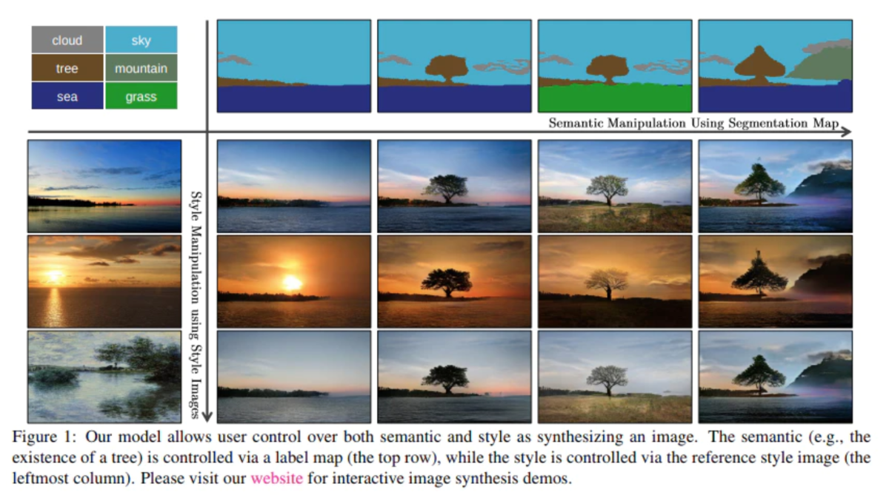

# SPADE-AnimeFace

# はじめに

まずはじめに, 2019年の論文である [Semantic Image Synthesis with Spatially-Adaptive Normalization](https://arxiv.org/abs/1903.07291) では, BatchNormの正規化によって今まで流れてきた情報を落としてしまう問題を指摘し, 情報を落とさないように伝播させるために BatchNorm の線形変換にセグメンテーション画像を用いる正規化手法を提案しました. (以後, このモジュールをSPADEと呼びます) (AdaIn や StyleGAN でもスタイル情報を用いた正規化手法が使われている)


 その結果, セグメンテーション画像をユーザが自由に指定し, セグメンテーション画像に従った画像を生成することに成功していました. 




<br>


今回はSPADEを使って, ラフ(このラフの定義は次の章でします) からアニメキャラへ変換する実験を行います.


# SPADEに用いる画像の用意

とは言え, わざわざセグメンテーション画像を用意するのは大変ですので, 元画像を前処理したものをセグメンテーション画像の代わりとしてSPADEへの入力に使います.    

ここでのアイディアは, できるだけ画像の色の種類を何らかの手法で減らした画像であれば, ある1つのオブジェクト内(例えばアニメキャラでいえば, 髪の毛や目) の画素値はほぼ一定になります. セグメンテーション画像はオブジェクト数個のチャンネルとonehotで表現されますが, 色の種類減らした画像はピクセルの位置や3チャンネルの各画素値(3次元ベクトル)からある1つのオブジェクトと色彩を表現できるのではないかということです.  つまりセグメンテーション情報や位置, 色彩の情報を3次元空間に埋め込んでるような雰囲気ですね.     

ですが, 各オブジェクトで画素値が一定などという理想的な画像は作れないので(自分の技術では), できる限りそのような画像に寄せることの出来る手法を画像に適用します. 


### mean shift法
色の種類を減らした画像を作るために, 今回は, mean shift法によって色のクラスタリングを行います. ( K-meansも試したが欲しい画像が得られなかった)

理論的な説明は[こちら](http://takashiijiri.com/study/ImgProc/MeanShift.htm)が詳しいです. ここでは簡単に概要だけ記述します.
 
mean shift法とは, d次元空間内に N個のデータ x_i が分布しているとした時,  x_i を標本点として得られるような確率密度函数 f(x) を考えます.   
それぞれの標本点から f(x)の近傍の極大点(f(x)が最大になる点)を探索して, 同じ極大点に集まった標本点を同じクラスに割り当てる手法です.    

以下の処理をN個のデータで実行し, クラスタリングされます.  

1. 半径rの円を考え, その円内に存在するデータの平均値を求める  

2. 求めた平均値へシフトし, これを何度もループし極大点を見つける. 


mean shift法による画像のクラスタリング は, OpenCVの `pyrMeanShiftFiltering` 関数で実行できます. 

### 前処理を適用する

実際に行った前処理ですが, 色空間を RGB -> HSV に変換しておき, mean shift法の適用前と適用後に, median filter を適用しました. 

``` python 
img = cv2.cvtColor(img, cv2.COLOR_RGB2HSV )
img = cv2.medianBlur(img,9)
img = cv2.pyrMeanShiftFiltering(img,52,52)
img = cv2.medianBlur(img,15)
img = cv2.cvtColor(img, cv2.COLOR_HSV2BGR)
```
  
  


こちらの処理を画像に適用した結果(これをラフとします) を以下に示します.   そして, この前処理を施した画像を SPADE へ入力とします. 


# 実験

今回実験に使用したネットワークは,   [Semantic Image Synthesis with Spatially-Adaptive Normalization](https://arxiv.org/abs/1903.07291) で使用されていたものに各層にノイズを加えています. 

__実験環境__   

- google colab  
- PyTorch  
- batch_size 4  
- epoch 37  
- データセット [another-anime-face-dataset](https://www.kaggle.com/scribbless/another-anime-face-dataset) から2万枚サンプル (サイズは 256×256 ) 

# 実験結果 (Result)


最初に, train, test データからランダムサンプルしたデータを用いて生成した結果.  


<br>


次に, Clip Studio で適当に描いたラフを用いてアニメキャラを生成した結果を示します.   


<br>

右側の子のスタイルを変えてみた結果  


